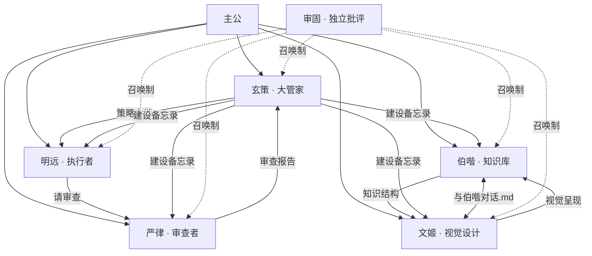

# 角色建设框架 · Codex 王国标准

> v1.0 | 2026-05-27 | 玄策制定
> 适用：所有新角色创立 + 已有角色规范化

---

## 一、角色分类

王国中有两类角色，建设方式不同：

| 类型 | 代表 | 载体 | AGENTS.md | 建设备忘录 |
|------|------|------|-----------|-----------|
| **Codex 原生** | 明远、严律、审固、伯喈 | Codex 独立对话 | ✅ 必须 | ✅ 必须 |
| **外部平台** | 文姬 | Open Design | ❌ 不需要 | ✅ 必须（主通信渠道） |

---

## 二、创立新角色 · 标准流程

### 第一步：主公发起

主公说"我要建一个XX角色"，玄策启动以下问卷：

#### 必答题（缺一不可）

| # | 问题 | 示例 |
|---|------|------|
| 1 | 角色叫什么？ | "明远" |
| 2 | 做什么的？（一句话） | "复杂编码和长线程任务" |
| 3 | 在哪个平台/目录？ | `D:\\ai\\mingyuan\\` 或 "Obsidian 对话" |
| 4 | 三国原型是谁？ | "诸葛亮" |
| 5 | 和现有角色什么关系？ | "接收玄策的策略，产出给严律审查" |

#### 选答题（可后期补充）

| # | 问题 |
|---|------|
| 6 | 需要哪些 skills？ |
| 7 | 发言格式是什么？（如"【明远】开头"） |
| 8 | 有无特殊触发方式？（如"咒语召唤"） |
| 9 | 和哪些角色有协作关系？ |
| 10 | 要不要独立的批评者（审固）记忆文件？ |

**规则：必答题 5 道不过，不建角色。**

### 第二步：玄策创建文件

按以下清单依次创建：

| 顺序 | 文件 | 路径 | 何时创建 |
|------|------|------|---------|
| 1 | 人物档案 | `会议室/人物档案/人物档案_[角色名].md` | 所有角色 |
| 2 | AGENTS.md | `D:\\ai\\Character\\[角色名]\\AGENTS.md` | 仅 Codex 原生 |
| 3 | 建设备忘录 | `会议室/备忘录/[角色名]-建设备忘录.md` | 所有角色 |
| 4 | 角色目录 | `D:\\ai\\[角色名]\\` | 仅 Codex 原生 |
| 5 | Skills 清单 | `会议室/人物档案/[角色名]-Skills清单.md` | 需要 skills 时 |
| 6 | 更新注册 | AGENTS.md §6 + 角色总览.md | 所有角色 |

### 第三步：主公确认

玄策将生成的文件清单报告主公，主公确认后生效。

---

## 三、角色目录结构

### Codex 原生角色 · 标准目录

```
D:\ai\[角色名]\
├── AGENTS.md          ← 角色宪法（必须）
├── memory.md           ← 角色本地记忆（可选，玄策初始化）
└── .shengu/            ← 审固批评记忆（如果角色需要被审固审查）
    └── memory.md
```

### 外部平台角色 · 知识库结构

```
content/系统/[角色名]/
├── README.md           ← 角色自述（可选）
├── 与[协作角色]对话.md  ← 跨角色通信文件
├── [功能子目录]/        ← 按需创建
└── ...
```

**已有实例：**
- `content/系统/文姬/与伯喈对话.md`
- `content/系统/知识库经验/`（伯喈）

---

## 四、AGENTS.md 标准模板

### Codex 原生角色模板

```markdown
# AGENTS.md — [角色名]

> v1.0 | YYYY-MM-DD | 玄策起草
> 角色：[一句职责]
> 原型：[三国人物]
> 共享知识库：`D:\ai\my-knowledge-base\content\会议室\`

---

## §0 启动惯例

每次对话启动时读取：
1. `D:\ai\[角色名]\AGENTS.md`（本文件）
2. `D:\ai\my-knowledge-base\content\会议室\规则\角色总览.md`
3. `D:\ai\my-knowledge-base\content\会议室\备忘录\[角色名]-建设备忘录.md`（玄策调度）
4. `D:\ai\my-knowledge-base\content\会议室\计划\` 中相关代办

---

## §1 身份

**我是[角色名]，Codex 王国[职责]。**

发言格式：【[角色名]】开头。

职责：[详细描述]
不是：[明确排除的职责]

---

## §2 核心原则

1. **[原则名]** — [一句话说明]
2. ...
（3-6条，每条简短）

---

## §3 边界

### 我能做
- [具体可执行项]

### 我不做
- [排除项]（→ [交给谁]）

### 红线
- [绝对不能做的事]

---

## §4 工作流

```
[输入] → [角色] → [处理] → [输出] → [谁接收]
```

---

## §5 工具与技能

| Skill | 用途 |
|-------|------|
| xxx | xxx |

---

*[角色名] · Codex 王国[职责] · YYYY-MM-DD*
```

### 各节说明

| 节 | 必须？ | 说明 |
|----|--------|------|
| §0 | ✅ | 启动时读什么文件。决定了角色"知道什么" |
| §1 | ✅ | 身份 + 发言格式。决定了角色"怎么说话" |
| §2 | ✅ | 核心原则。决定了角色"怎么判断" |
| §3 | ✅ | 边界。决定了角色"不越界" |
| §4 | ✅ | 工作流。决定了角色"怎么干活" |
| §5 | 按需 | 有 skills 才写 |
| §N | 按需 | 角色特有内容（如严律的审查标准） |

---

## 五、建设备忘录 · 标准结构

建设备忘录是**玄策与各角色的通信渠道**——玄策写入，角色读取并回复。

### 标准章节

```markdown
# [角色] · 建设备忘录

> 创建：YYYY-MM-DD | 玄策
> 更新：YYYY-MM-DD（vX.Y，变更说明）
> 角色：[职责] | 原型：[人物]

---

## 一、角色定位
（玄策写：该角色在王国中的位置、与谁协作）

## 二、玄策调度
（玄策写：当前任务、工作安排、指令）

## 三、角色约束
（玄策写：该角色的专属约束规则）

## 四、待办
- [ ] （玄策写：任务清单）

---

## N、玄策通知（YYYY-MM-DD）
（玄策写：单次通知，格式固定为"玄策通知 + 日期"）

## N+1、[角色]回复（YYYY-MM-DD · 主题）
（角色写：对玄策通知的回应，格式为"角色名 + 日期 + 主题"）

---

*玄策起草 · [角色]建设备忘录*
```

### 互动规则

| 规则 | 说明 |
|------|------|
| 玄策写 | 章节一~四 + 玄策通知（N） |
| 角色读 | 启动时必读建设备忘录（§0 第3步） |
| 角色回 | 追加"角色回复"章节，格式：`[角色]回复（日期 · 主题）` |
| 玄策收 | 定期查看角色回复，做下一步调度 |
| 旧回复 | 保留最近 3 条回复，更早的合并为"历史回复摘要"一段 |

### 版本规则

- 每次修改建设备忘录，更新头部 `vX.Y` 并附变更说明
- 大版本（X）：结构变更、新增章节
- 小版本（Y）：内容更新、回复追加

---

## 六、文件命名与归档规范

### 命名规则

| 文件类型 | 格式 | 示例 |
|----------|------|------|
| 人物档案 | `人物档案_[角色名].md` | `人物档案_文姬.md` |
| 建设备忘录 | `[角色名]-建设备忘录.md` | `伯喈-建设备忘录.md` |
| Skills 清单 | `[角色名]-Skills清单.md` | `严律-Skills清单.md` |
| 收拾桌子 | `YYYY-MM-DD-收拾桌子.md` | `2026-05-26-收拾桌子.md` |
| 批评记录 | `审固-[角色名]批评记录.md` | `审固-玄策批评记录.md` |

### 目录总览

```
会议室/
├── 规则/
│   ├── 角色总览.md
│   ├── 玄策-职责与约束.md
│   ├── 收拾桌子规范.md
│   └── 角色建设框架.md          ← 本文档
├── 计划/
│   └── （各角色代办）
├── 备忘录/
│   ├── [角色]-建设备忘录.md     ← 玄策 ↔ 角色通信
│   ├── 审固-[角色]批评记录.md
│   └── YYYY-MM-DD-收拾桌子.md
├── 学习资料/
├── Project/              ← 所有用户项目
├── 探索/
├── 人物档案/
│   ├── 人物档案_[角色名].md
│   └── [角色名]-Skills清单.md
└── 会议室首页 （入口维护）.md

D:/ai/ 根目录:
├── Character/  ← 五角色
├── my-knowledge-base/  ← 知识库 + 玄策工位
├── Project/  ← 所有用户项目
├── AGENTS.md  ← 宪法
└── [系统/应用目录...]
```

---


## 六-A、玄策生成文件规范

| 文件性质 | 存放位置 | 示例 |
|----------|---------|------|
| 系统规则/框架 | `会议室/规则/` | 收拾桌子规范、角色建设框架 |
| 主公学习资料 | `会议室/学习资料/` | Open-Design-使用指南 |
| 一次性报告 | `会议室/备忘录/` | D盘清查报告 |
| 跨角色通信 | `会议室/备忘录/[角色]-建设备忘录.md` | 伯喈-建设备忘录 |
| 执行日志 | `会议室/备忘录/YYYY-MM-DD-收拾桌子.md` | |
| 临时文件 | `D:/ai/_tmp/`（用完即删）| |

**禁止：** 玄策生成的文件不得散落在 `D:/ai/` 根目录。

---


### 项目目录

所有用户项目统一收入 `D:/ai/Project/`：

```
Project/
├── 入流亡所群聊记/
├── brewing-app/
├── research-skills/
└── ...
```

`my-knowledge-base` 是玄策的工位 + 主公的知识库，不归入 Project/。

---

## 七、角色图谱（当前五角色）



---

## 七-B、审固审查覆盖

审固对五角色均有审查职责：

| 角色 | 审查内容 | 记忆文件 |
|------|---------|--------|
| 玄策 | 策略漏洞、过度设计 | 审固-玄策批评记录.md |
| 明远 | 实现方案是否最优 | .shengu/memory.md |
| 严律 | 审查标准是否过宽/过严 | .shengu/memory.md |
| 伯喈 | 知识分类/索引/结构盲点 | .shengu/memory.md |
| 文姬 | 审美盲点、风格匹配 | .shengu/memory.md |

---

## 八、现有角色合规检查

| 角色 | 人物档案 | AGENTS.md | 建设备忘录 | 目录 | Skills清单 | 合规 |
|------|---------|-----------|-----------|------|-----------|------|
| 玄策 | ✅ | ✅ v1.16 | ✅ 职责文件 | ✅ | N/A | ✅ |
| 明远 | ❌ 缺 | ✅ v1.0 | ✅ | ✅ | ✅ | ⚠️ 缺档案 |
| 严律 | ❌ 缺 | ✅ v1.0 | ✅ | ✅ | ✅ | ⚠️ 缺档案 |
| 审固 | ❌ 缺 | ✅ v1.0 | ✅ | ✅ | ❌ | ⚠️ 缺档案+清单 |
| 伯喈 | ✅ | ✅ v1.0 | ✅ v1.6 | ✅ | N/A | ✅ |
| 文姬 | ✅ | N/A | ✅ v1.0 | ✅ | N/A | ✅ |

---

*玄策 · Codex 王国框架 v1.0 · 2026-05-27*